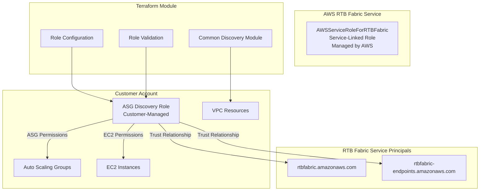

# RTB Fabric ASG Managed Endpoint Refactoring Design

## Overview

This design document outlines the technical approach for refactoring the RTB Fabric Terraform module to support the GA service changes for ASG managed endpoints. Following the same pattern as the EKS managed endpoint refactor, the key change is transitioning from the legacy HeimdallAssumeRole approach to the new service-linked role model, where AWS automatically manages the AWSServiceRoleForRTBFabric role, and customers provide their own IAM roles with proper trust relationships for ASG discovery.

The design supports two distinct configuration patterns:
1. **Manual Setup**: Customer provides pre-configured ASG discovery role with trust relationships and permissions
2. **Automatic Setup**: Module creates ASG discovery role with proper trust policy and permissions

## Architecture

### Current State Analysis

The existing ASG managed endpoint implementation uses:
- `role_arn` field pointing to customer-managed role (often HeimdallAssumeRole)
- Direct role ARN specification in configuration
- No automatic role creation or validation

### Target State Architecture



### Component Responsibilities

1. **AWS RTB Fabric Service**: Automatically creates and manages AWSServiceRoleForRTBFabric
2. **Customer**: Provides ASG discovery role with trust relationships to RTB Fabric service principals
3. **Terraform Module**: Validates, configures, and manages ASG discovery role
4. **Common Discovery Module**: Provides VPC, subnet, and security group discovery capabilities

## Components and Interfaces

### 1. ASG Discovery Role Management Component

**Purpose**: Handle ASG discovery role configuration and validation

**Key Functions**:
- Validate ASG discovery role trust policy includes RTB Fabric principals
- Configure role trust policy (automatic mode)
- Attach ASG discovery permissions (automatic mode)
- Validate existing permissions (manual mode)

**Interfaces**:
```hcl
# Input: ASG discovery role configuration
variable "asg_discovery_role" {
  description = "ASG discovery role name (creates if not provided)"
  type        = string
  default     = null
}

# Configuration flags
variable "auto_create_asg_role" {
  description = "Automatically create ASG discovery role if not provided"
  type        = bool
  default     = true
}
```

### 2. ASG Discovery Permissions Component

**Purpose**: Manage IAM permissions for ASG and EC2 resource discovery

**Key Functions**:
- Create inline policy with ASG discovery permissions
- Apply region-specific conditions to permissions
- Validate existing permissions (manual mode)

**Interfaces**:
```hcl
# ASG Discovery Policy
resource "aws_iam_role_policy" "asg_discovery_policy" {
  name = "${local.asg_discovery_role_name}Policy"
  role = local.asg_discovery_role_name

  policy = jsonencode({
    Version = "2012-10-17"
    Statement = [
      {
        Sid    = "AsgEndpointsIpDiscovery"
        Effect = "Allow"
        Action = [
          "autoscaling:DescribeAutoScalingGroups",
          "ec2:DescribeInstanceStatus", 
          "ec2:DescribeInstances",
          "ec2:DescribeAvailabilityZones"
        ]
        Resource = "*"
        Condition = {
          StringEquals = {
            "ec2:Region" = data.aws_region.current.name
          }
        }
      }
    ]
  })
}
```

### 3. Common Discovery Integration Component

**Purpose**: Leverage shared discovery module for network configuration

**Key Functions**:
- Provide VPC discovery capabilities
- Provide subnet discovery capabilities  
- Provide security group discovery capabilities
- Validate customer-provided network configuration

**Interfaces**:
```hcl
# Common discovery module integration
module "common_discovery" {
  source = "./modules/common_discovery"
  
  # Configuration parameters for discovery
  cluster_name = var.cluster_name  # If applicable
  vpc_tags     = var.vpc_tags      # If applicable
}

# Customer must provide subnet IDs that match ASG configuration
variable "subnet_ids" {
  description = "Subnet IDs that match Auto Scaling Group subnet configuration"
  type        = list(string)
}
```

### 4. Validation Component

**Purpose**: Pre-flight validation for ASG discovery role configuration

**Key Functions**:
- Check trust policy compliance
- Verify ASG and EC2 permissions
- Validate ASG configuration parameters
- Confirm network configuration alignment

**Interfaces**:
```hcl
# Data sources for validation
data "aws_iam_role" "asg_discovery_role" {
  count = var.asg_discovery_role != null ? 1 : 0
  name  = var.asg_discovery_role
}

data "aws_iam_role_policy" "asg_discovery_policy" {
  count = var.asg_discovery_role != null ? 1 : 0
  name  = "${var.asg_discovery_role}Policy"
  role  = var.asg_discovery_role
}
```

## Data Models

### 1. ASG Discovery Role Configuration

```hcl
variable "auto_scaling_groups_configuration" {
  description = "Auto Scaling Groups configuration for RTB Fabric"
  type = object({
    auto_scaling_group_name_list = list(string)
    asg_discovery_role          = optional(string)  # Role name (not ARN)
    auto_create_role            = optional(bool, true)
  })
}
```

### 2. Trust Policy Requirements

```json
{
  "Version": "2012-10-17",
  "Statement": [
    {
      "Effect": "Allow",
      "Principal": {
        "Service": [
          "rtbfabric.amazonaws.com",
          "rtbfabric-endpoints.amazonaws.com"
        ]
      },
      "Action": "sts:AssumeRole"
    }
  ]
}
```

### 3. ASG Discovery Permissions Policy

```json
{
  "Version": "2012-10-17",
  "Statement": [
    {
      "Sid": "AsgEndpointsIpDiscovery",
      "Effect": "Allow",
      "Action": [
        "autoscaling:DescribeAutoScalingGroups",
        "ec2:DescribeInstanceStatus",
        "ec2:DescribeInstances", 
        "ec2:DescribeAvailabilityZones"
      ],
      "Resource": "*",
      "Condition": {
        "StringEquals": {
          "ec2:Region": "us-east-1"
        }
      }
    }
  ]
}
```

### 4. Updated ASG Configuration Model

```hcl
variable "responder_gateway" {
  type = object({
    # ... other fields ...
    managed_endpoint_configuration = optional(object({
      auto_scaling_groups_configuration = optional(object({
        auto_scaling_group_name_list = list(string)
        # New fields replacing role_arn
        asg_discovery_role = optional(string)  # Role name for RTB Fabric service to assume
        auto_create_role   = optional(bool, true)
      }))
      # ... other endpoint configurations ...
    }))
  })
}
```

## Implementation Strategy

### Phase 1: Legacy Cleanup and Variable Updates
1. Update `auto_scaling_groups_configuration` structure to remove `role_arn`
2. Add new fields: `asg_discovery_role` and `auto_create_role`
3. Update variable validation rules for new structure
4. Add backward compatibility warnings for deprecated fields

### Phase 2: ASG Discovery Role Management
1. Create locals for ASG discovery role name computation (similar to EKS pattern)
2. Add ASG discovery role creation resource with conditional logic
3. Implement trust policy configuration with RTB Fabric service principals
4. Add ASG discovery permissions policy with region conditions

### Phase 3: Common Discovery Integration
1. Integrate with existing common discovery module capabilities
2. Ensure customer-provided subnet IDs are validated
3. Maintain requirement for customer to specify ASG-matching subnets
4. Preserve customer responsibility for VPC and security group configuration

### Phase 4: Validation and Error Handling
1. Add comprehensive validation data sources for manual setup
2. Implement clear error messages for validation failures
3. Add remediation guidance in error messages
4. Create validation checks for ASG configuration parameters

### Phase 5: Resource Updates and Dependencies
1. Update `aws_cloudcontrolapi_resource.responder_gateway` to use computed role ARN
2. Add proper dependencies for ASG discovery role creation
3. Update resource naming from any remaining Heimdall references
4. Ensure consistent RTBFabric naming across all ASG-related components

## Error Handling

### Validation Errors

**Trust Policy Missing**:
```
Error: ASG discovery role trust policy validation failed
The role 'MyAsgDiscoveryRole' does not include required RTB Fabric service principals.

Required principals:
- rtbfabric.amazonaws.com
- rtbfabric-endpoints.amazonaws.com

Remediation: Update the role's trust policy to include these service principals.
```

**Missing ASG Permissions**:
```
Error: Required ASG discovery permissions not found
The role 'MyAsgDiscoveryRole' does not have required ASG and EC2 permissions.

Required permissions:
- autoscaling:DescribeAutoScalingGroups
- ec2:DescribeInstanceStatus
- ec2:DescribeInstances
- ec2:DescribeAvailabilityZones

Remediation: Attach a policy with these permissions or set auto_create_role = true.
```

**ASG Configuration Missing**:
```
Error: Auto Scaling Group configuration incomplete
auto_scaling_group_name_list is required when using ASG managed endpoints.

Remediation: Provide a list of Auto Scaling Group names to monitor.
```

### Configuration Conflicts

**Manual vs Automatic Mode**:
```
Error: Configuration conflict detected
Cannot use auto_create_role = false with missing ASG discovery role.

Remediation: Either set auto_create_role = true or provide asg_discovery_role.
```

## Testing Strategy

### Example Migration Focus
The primary testing approach will focus on migrating the existing ASG example in `examples/responder-gateway-asg/main.tf` to work with the new GA service model.

### Migration Targets
1. **Current ASG Example**: Update `examples/responder-gateway-asg/main.tf` to use new configuration structure
2. **Role Configuration Examples**: Demonstrate both manual and automatic setup approaches
3. **Trust Policy Examples**: Show proper ASG discovery role trust policy configuration
4. **Validation Examples**: Include examples of pre-flight validation for manual setup

### Test Cases
1. **Automatic Role Creation**: Test default RTBFabricAsgDiscoveryRole creation
2. **Custom Role Name**: Test custom role name specification
3. **Manual Role Setup**: Test with pre-configured customer role
4. **Validation Failures**: Test various validation failure scenarios
5. **Common Discovery Integration**: Test network configuration discovery

## Migration Path

### Backward Compatibility
- Maintain existing variable structure where possible during transition
- Provide deprecation warnings for `role_arn` field
- Support gradual migration from HeimdallAssumeRole

### Migration Steps for Users
1. **Assessment**: Identify current ASG managed endpoint usage
2. **Role Planning**: Decide between automatic or manual role setup
3. **Configuration Update**: Update module configuration to use new structure
4. **Validation**: Verify new configuration works correctly
5. **Cleanup**: Remove legacy role references (if no longer needed)

### Breaking Changes
- `role_arn` field removed from `auto_scaling_groups_configuration`
- New required field: `auto_scaling_group_name_list` (already exists)
- Resource names changed from any remaining `heimdall-*` to `rtbfabric-*`
- Default role name changed to `RTBFabricAsgDiscoveryRole`

## Local Values Implementation

Following the EKS pattern, the implementation will use local values for role computation:

```hcl
locals {
  # ASG Discovery Role name - use provided role name or default
  asg_discovery_role_name = var.responder_gateway.managed_endpoint_configuration != null && var.responder_gateway.managed_endpoint_configuration.auto_scaling_groups_configuration != null ? (
    var.responder_gateway.managed_endpoint_configuration.auto_scaling_groups_configuration.asg_discovery_role != null ?
    var.responder_gateway.managed_endpoint_configuration.auto_scaling_groups_configuration.asg_discovery_role :
    var.rtbfabric_asg_discovery_role_name
  ) : null

  # ASG Discovery Role ARN - computed from role name  
  asg_discovery_role_arn = local.asg_discovery_role_name != null ? (
    "arn:aws:iam::${data.aws_caller_identity.current.account_id}:role/${local.asg_discovery_role_name}"
  ) : null
}
```

This approach ensures consistency with the EKS implementation and provides a clean separation between role name management and ARN computation.