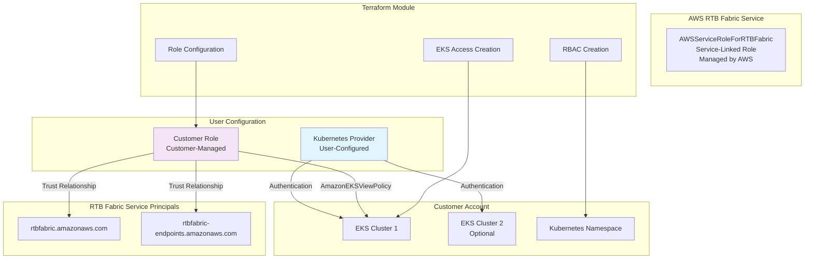

# RTB Fabric EKS Managed Endpoint Refactoring Design

## Overview

This design document outlines the technical approach for refactoring the RTB Fabric Terraform module to support the GA service changes for EKS managed endpoints and modernize the module architecture. The key changes include:

1. **Service Model Transition**: Moving from legacy HeimdallAssumeRole to the new service-linked role model where AWS manages AWSServiceRoleForRTBFabric
2. **Provider Architecture Modernization**: Externalizing kubernetes provider configuration to follow Terraform best practices and eliminate "legacy module" restrictions
3. **Enhanced Flexibility**: Supporting multi-cluster scenarios and diverse authentication patterns

The design supports two distinct configuration patterns:
1. **Manual Setup**: Customer pre-configures their role with trust relationships to RTB Fabric service principals and all required permissions
2. **Automatic Setup**: Module configures the customer role trust policy and permissions based on auto-creation flags

## Architecture

### Current State Analysis

The existing module has several limitations:
- `HeimdallAssumeRole` as the default role (legacy approach)
- Internal kubernetes provider configuration causing "legacy module" restrictions
- `cluster_access_role_arn` parameter creating complex authentication scenarios
- Heimdall terminology throughout resource naming
- Limited flexibility for multi-cluster deployments

### Target State Architecture



### Component Responsibilities

1. **User**: Configures kubernetes provider with appropriate authentication for their EKS clusters
2. **AWS RTB Fabric Service**: Automatically creates and manages AWSServiceRoleForRTBFabric
3. **Customer**: Provides IAM role with trust relationships to RTB Fabric service principals
4. **Terraform Module**: Configures customer role and manages EKS access/RBAC using provided kubernetes provider

## Components and Interfaces

### 1. Provider Configuration Component

**Purpose**: Accept kubernetes provider configuration from users

**Key Functions**:
- Support both default and aliased kubernetes providers
- Enable multi-cluster scenarios with multiple provider instances
- Remove internal provider configuration to eliminate "legacy module" restrictions

**Interfaces**:
```hcl
# Provider requirements in versions.tf
terraform {
  required_providers {
    kubernetes = {
      source  = "hashicorp/kubernetes"
      version = ">= 2.20"
      configuration_aliases = [kubernetes]  # Optional alias support
    }
  }
}

# Usage patterns:
# 1. Default provider (simple case)
module "rtb_fabric" {
  # Uses default kubernetes provider
}

# 2. Aliased provider (multi-cluster case)
module "rtb_fabric" {
  providers = {
    kubernetes = kubernetes.cluster_a
  }
}
```

### 2. Role Management Component

**Purpose**: Handle customer role configuration without kubernetes authentication complexity

**Key Functions**:
- Configure role trust policy (automatic mode)
- Attach AmazonEKSViewPolicy (automatic mode)
- Remove kubernetes authentication parameters

**Interfaces**:
```hcl
# Simplified EKS configuration (cluster_access_role_arn removed)
variable "eks_endpoints_configuration" {
  type = object({
    endpoints_resource_name      = string
    endpoints_resource_namespace = string
    cluster_name                = string
    eks_service_discovery_role  = optional(string)
    auto_create_access          = optional(bool, true)
    auto_create_rbac            = optional(bool, true)
    auto_create_role            = optional(bool, true)
    # cluster_access_role_arn REMOVED - handled by kubernetes provider
  })
}
```

### 3. EKS Access Management Component

**Purpose**: Manage EKS cluster access entries using provided kubernetes provider

**Key Functions**:
- Create EKS access entries for customer role
- Associate AmazonEKSViewPolicy with namespace scope
- Use kubernetes provider configured by user

**Interfaces**:
```hcl
# EKS Access Entry Resource (unchanged)
resource "aws_eks_access_entry" "rtbfabric" {
  cluster_name  = var.cluster_name
  principal_arn = local.eks_service_discovery_role_arn
  type          = "STANDARD"
}
```

### 4. RBAC Management Component

**Purpose**: Create Kubernetes RBAC resources using provided kubernetes provider

**Key Functions**:
- Create namespace-scoped Role for endpoint reading
- Create RoleBinding for customer role
- Use kubernetes provider authentication configured by user

**Interfaces**:
```hcl
# Kubernetes Role Resource (provider reference removed)
resource "kubernetes_role" "rtbfabric_endpoint_reader" {
  # provider = kubernetes  # Uses default or passed provider
  metadata {
    namespace = var.endpoints_resource_namespace
    name      = "rtbfabric-endpoint-reader"
  }
  # ... role rules
}
```

### 5. Validation Component (Simplified)

**Purpose**: Minimal validation focused on RTB Fabric concerns

**Key Functions**:
- Basic IAM role trust policy validation
- Remove kubernetes-specific validations (user responsibility)

**Interfaces**:
```hcl
# Simplified validation - kubernetes validations removed
resource "null_resource" "validate_service_discovery_role_trust_policy" {
  # Only validates IAM trust policy, not kubernetes access
}
```

## Data Models

### 1. Simplified EKS Configuration Model

```hcl
variable "eks_endpoints_configuration" {
  type = object({
    endpoints_resource_name      = string
    endpoints_resource_namespace = string
    cluster_name                = string
    eks_service_discovery_role  = optional(string)  # Role name for RTB Fabric service
    auto_create_access          = optional(bool, true)
    auto_create_rbac            = optional(bool, true)
    auto_create_role            = optional(bool, true)
    # cluster_access_role_arn REMOVED - kubernetes provider handles authentication
  })
}
```

### 2. Trust Policy Requirements (Unchanged)

```json
{
  "Version": "2012-10-17",
  "Statement": [
    {
      "Effect": "Allow",
      "Principal": {
        "Service": [
          "rtbfabric.amazonaws.com",
          "rtbfabric-endpoints.amazonaws.com"
        ]
      },
      "Action": "sts:AssumeRole"
    }
  ]
}
```

### 3. Provider Configuration Patterns

```hcl
# Pattern 1: Single cluster with default provider
provider "kubernetes" {
  host                   = data.aws_eks_cluster.cluster.endpoint
  cluster_ca_certificate = base64decode(data.aws_eks_cluster.cluster.certificate_authority[0].data)
  exec {
    api_version = "client.authentication.k8s.io/v1beta1"
    command     = "aws"
    args        = ["eks", "get-token", "--cluster-name", "my-cluster"]
  }
}

module "rtb_fabric" {
  # Uses default kubernetes provider
}

# Pattern 2: Multi-cluster with aliased providers
provider "kubernetes" {
  alias = "cluster_a"
  # ... cluster A configuration
}

provider "kubernetes" {
  alias = "cluster_b"
  # ... cluster B configuration
}

module "rtb_fabric_a" {
  providers = {
    kubernetes = kubernetes.cluster_a
  }
}

module "rtb_fabric_b" {
  providers = {
    kubernetes = kubernetes.cluster_b
  }
}
```

## Implementation Strategy

### Phase 1: Provider Architecture Modernization
1. Update `versions.tf` to add kubernetes provider configuration aliases
2. Remove internal kubernetes provider configuration from `eks_helper.tf`
3. Update kubernetes resources to use provided/default provider
4. Remove `cluster_access_role_arn` parameter and related logic

### Phase 2: Legacy Cleanup
1. Remove HeimdallAssumeRole default role creation logic
2. Update variable names from `heimdall_*` to `rtbfabric_*`
3. Replace Heimdall terminology in resource names and descriptions

### Phase 3: Variable Interface Simplification
1. Remove `cluster_access_role_arn` from `eks_endpoints_configuration`
2. Update variable validation to remove kubernetes authentication parameters
3. Simplify EKS configuration interface

### Phase 4: Validation Simplification
1. Remove kubernetes-specific validations (already mostly disabled)
2. Keep only IAM trust policy validation
3. Remove complex kubernetes access validation logic

### Phase 5: Example Updates
1. Add kubernetes provider configurations to all EKS examples
2. Demonstrate single-cluster and multi-cluster patterns
3. Update examples to use simplified variable interface
4. Remove `depends_on` from module calls (no longer needed)

## Error Handling

### Simplified Validation Approach

With the new architecture, error handling focuses on RTB Fabric-specific concerns while delegating kubernetes authentication issues to the user-configured provider.

### RTB Fabric Validation Errors

**Trust Policy Missing**:
```
Error: Customer role trust policy validation failed
The role 'arn:aws:iam::123456789012:role/MyRole' does not include required RTB Fabric service principals.

Required principals:
- rtbfabric.amazonaws.com
- rtbfabric-endpoints.amazonaws.com

Remediation: Update the role's trust policy to include these service principals.
```

### Kubernetes Provider Errors

**Provider Not Configured**:
```
Error: No kubernetes provider configured
The module requires a kubernetes provider to manage RBAC resources.

Remediation: Configure a kubernetes provider or pass one via the providers block.
```

**Authentication Failures**:
These are now handled by the user-configured kubernetes provider and will surface as standard Terraform provider authentication errors, making them easier to diagnose and resolve.

### Configuration Conflicts

**Auto-creation Conflicts**:
```
Error: Configuration conflict detected
Cannot use auto_create_rbac = true without kubernetes provider access to the cluster.

Remediation: Either configure kubernetes provider authentication or set auto_create_rbac = false.
```

## Testing Strategy

### Example-Driven Validation
The primary testing approach focuses on updating and validating examples to demonstrate the new architecture patterns.

### Example Update Targets
1. **Single-Cluster Examples**: Update existing EKS examples to use external kubernetes provider configuration
2. **Multi-Cluster Examples**: Demonstrate e2e-test pattern with multiple kubernetes providers
3. **Provider Pattern Examples**: Show both default and aliased provider usage
4. **Authentication Pattern Examples**: Demonstrate different kubernetes provider authentication methods

### Validation Approach
1. **Terraform Plan/Apply**: Verify all examples can plan and apply successfully
2. **Provider Flexibility**: Test with different kubernetes provider authentication methods
3. **Multi-Cluster Scenarios**: Validate e2e-test example with separate cluster providers
4. **Backward Compatibility**: Ensure no breaking changes to core RTB Fabric functionality

## Migration Path

### Breaking Changes (No Customer Impact)
Since there are no existing customers, we can make clean breaking changes:

1. **Provider Architecture**: Kubernetes provider must now be configured externally
2. **Variable Interface**: `cluster_access_role_arn` parameter removed from `eks_endpoints_configuration`
3. **Legacy Cleanup**: `HeimdallAssumeRole` default creation removed
4. **Resource Naming**: Resource names changed from `heimdall-*` to `rtbfabric-*`

### Migration Benefits
1. **Modern Terraform Practices**: Eliminates "legacy module" restrictions
2. **Enhanced Flexibility**: Supports complex authentication and multi-cluster scenarios
3. **Cleaner Interface**: Simplified variable structure focused on RTB Fabric concerns
4. **Better Error Handling**: Kubernetes authentication errors are clearer and more actionable

### Implementation Order
1. **Core Module Changes**: Update provider requirements and remove internal provider
2. **Variable Cleanup**: Remove kubernetes authentication parameters
3. **Example Updates**: Add kubernetes provider configurations to all examples
4. **Validation Simplification**: Remove kubernetes-specific validations
5. **Documentation**: Update examples to demonstrate new patterns