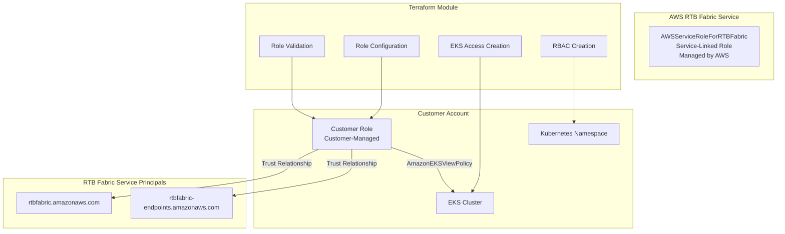

# RTB Fabric EKS Managed Endpoint Refactoring Design

## Overview

This design document outlines the technical approach for refactoring the RTB Fabric Terraform module to support the GA service changes for EKS managed endpoints. The key change is transitioning from the legacy HeimdallAssumeRole approach to the new service-linked role model, where AWS automatically manages the AWSServiceRoleForRTBFabric role, and customers provide their own IAM roles with proper trust relationships.

The design supports two distinct configuration patterns:
1. **Manual Setup**: Customer pre-configures their role with trust relationships to RTB Fabric service principals and all required permissions
2. **Automatic Setup**: Module configures the customer role trust policy and permissions based on auto-creation flags

## Architecture

### Current State Analysis

The existing module uses:
- `HeimdallAssumeRole` as the default role (legacy approach)
- Heimdall terminology throughout resource naming
- Direct role creation and management by the module

### Target State Architecture



### Component Responsibilities

1. **AWS RTB Fabric Service**: Automatically creates and manages AWSServiceRoleForRTBFabric
2. **Customer**: Provides IAM role with trust relationships to RTB Fabric service principals
3. **Terraform Module**: Validates, configures, and manages EKS access for customer role

## Components and Interfaces

### 1. Role Management Component

**Purpose**: Handle customer role configuration and validation

**Key Functions**:
- Validate customer role trust policy includes RTB Fabric principals
- Configure role trust policy (automatic mode)
- Attach AmazonEKSViewPolicy (automatic mode)
- Validate existing permissions (manual mode)

**Interfaces**:
```hcl
# Input: Customer role ARN
variable "customer_role_arn" {
  description = "Customer-provided IAM role ARN"
  type        = string
}

# Configuration flags
variable "auto_create_access" {
  description = "Automatically configure role trust policy and EKS permissions"
  type        = bool
  default     = true
}
```

### 2. EKS Access Management Component

**Purpose**: Manage EKS cluster access entries and permissions

**Key Functions**:
- Create EKS access entries for customer role
- Associate AmazonEKSViewPolicy with namespace scope
- Validate existing EKS access (manual mode)

**Interfaces**:
```hcl
# EKS Access Entry Resource
resource "aws_eks_access_entry" "rtbfabric" {
  cluster_name  = var.cluster_name
  principal_arn = var.customer_role_arn
  type          = "STANDARD"
}
```

### 3. RBAC Management Component

**Purpose**: Create Kubernetes RBAC resources for endpoint access

**Key Functions**:
- Create namespace-scoped Role for endpoint reading
- Create RoleBinding for customer role
- Validate existing RBAC (manual mode)

**Interfaces**:
```hcl
# Kubernetes Role Resource
resource "kubernetes_role" "rtbfabric_endpoint_reader" {
  metadata {
    namespace = var.endpoints_resource_namespace
    name      = "rtbfabric-endpoint-reader"
  }
  # ... role rules
}
```

### 4. Validation Component

**Purpose**: Pre-flight validation for manual setup configurations

**Key Functions**:
- Check trust policy compliance
- Verify policy attachments
- Confirm EKS access exists
- Validate RBAC permissions

**Interfaces**:
```hcl
# Data sources for validation
data "aws_iam_role" "customer_role" {
  name = var.customer_role_name
}

data "aws_iam_role_policy_attachment" "eks_view_policy" {
  role       = var.customer_role_name
  policy_arn = "arn:aws:eks::aws:cluster-access-policy/AmazonEKSViewPolicy"
}
```

## Data Models

### 1. Customer Role Configuration

```hcl
variable "customer_role_configuration" {
  description = "Customer role configuration for RTB Fabric"
  type = object({
    role_arn                = string
    auto_create_access      = optional(bool, true)
    auto_create_rbac        = optional(bool, true)
    cluster_access_role_arn = optional(string)  # For kubectl authentication
  })
}
```

### 2. Trust Policy Requirements

```json
{
  "Version": "2012-10-17",
  "Statement": [
    {
      "Effect": "Allow",
      "Principal": {
        "Service": [
          "rtbfabric.amazonaws.com",
          "rtbfabric-endpoints.amazonaws.com"
        ]
      },
      "Action": "sts:AssumeRole"
    }
  ]
}
```

### 3. EKS Configuration Model

```hcl
variable "eks_endpoints_configuration" {
  type = object({
    endpoints_resource_name      = string
    endpoints_resource_namespace = string
    cluster_name                = string
    customer_role_arn           = string
    auto_create_access          = optional(bool, true)
    auto_create_rbac            = optional(bool, true)
    cluster_access_role_arn     = optional(string)
  })
}
```

## Implementation Strategy

### Phase 1: Legacy Cleanup
1. Remove HeimdallAssumeRole default role creation logic
2. Update variable names from `heimdall_*` to `rtbfabric_*`
3. Replace Heimdall terminology in resource names and descriptions

### Phase 2: Role Management Refactoring
1. Replace `local.eks_role_arn` logic with customer role ARN
2. Add customer role validation data sources
3. Implement trust policy configuration for automatic mode

### Phase 3: EKS Access Management
1. Update EKS access entry creation to use customer role
2. Add validation for manual setup mode
3. Implement conditional resource creation based on auto-creation flags

### Phase 4: RBAC Management
1. Update Kubernetes resource naming from `heimdall-*` to `rtbfabric-*`
2. Add RBAC validation for manual setup
3. Implement conditional RBAC creation

### Phase 5: Validation and Error Handling
1. Add comprehensive validation data sources
2. Implement clear error messages for validation failures
3. Add remediation guidance in error messages

## Error Handling

### Validation Errors

**Trust Policy Missing**:
```
Error: Customer role trust policy validation failed
The role 'arn:aws:iam::123456789012:role/MyRole' does not include required RTB Fabric service principals.

Required principals:
- rtbfabric.amazonaws.com
- rtbfabric-endpoints.amazonaws.com

Remediation: Update the role's trust policy to include these service principals.
```

**Missing EKS Policy**:
```
Error: Required EKS policy not attached
The role 'arn:aws:iam::123456789012:role/MyRole' does not have AmazonEKSViewPolicy attached.

Remediation: Attach the AmazonEKSViewPolicy to the role or set auto_create_access = true.
```

**EKS Access Missing**:
```
Error: EKS cluster access not configured
The role 'arn:aws:iam::123456789012:role/MyRole' does not have access to cluster 'my-cluster'.

Remediation: Create an EKS access entry for the role or set auto_create_access = true.
```

### Configuration Conflicts

**Manual vs Automatic Mode**:
```
Error: Configuration conflict detected
Cannot use auto_create_access = false with missing EKS access entry.

Remediation: Either set auto_create_access = true or manually create the required EKS access entry.
```

## Testing Strategy

### Example Migration Focus
The primary testing approach will focus on migrating existing examples in the `examples/` folder to work with the new GA service model, specifically for cases where EKS managed endpoint configuration was used.

### Example Migration Targets
1. **Existing EKS Examples**: Update any examples that use `eks_endpoints_configuration`
2. **Role Configuration Examples**: Demonstrate both manual and automatic setup approaches
3. **Trust Policy Examples**: Show proper customer role trust policy configuration
4. **Validation Examples**: Include examples of pre-flight validation for manual setup

## Migration Path

### Backward Compatibility
- Maintain existing variable structure where possible
- Provide deprecation warnings for legacy configurations
- Support gradual migration from HeimdallAssumeRole

### Migration Steps for Users
1. **Assessment**: Identify current HeimdallAssumeRole usage
2. **Role Creation**: Create customer-managed role with RTB Fabric trust
3. **Configuration Update**: Update module configuration to use customer role
4. **Validation**: Verify new configuration works correctly
5. **Cleanup**: Remove legacy HeimdallAssumeRole (if no longer needed)

### Breaking Changes
- `HeimdallAssumeRole` default creation removed
- Resource names changed from `heimdall-*` to `rtbfabric-*`
- Required customer role ARN parameter added